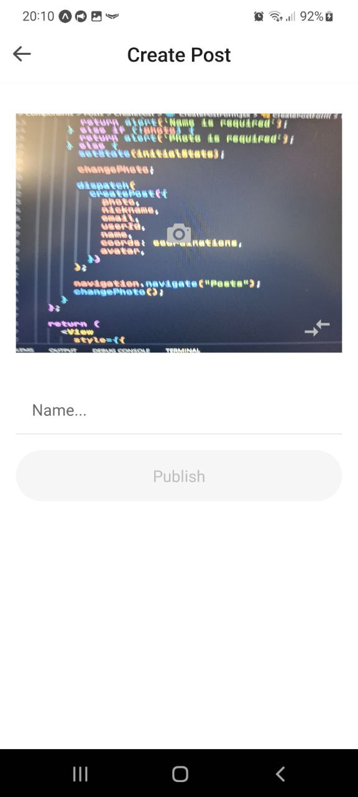
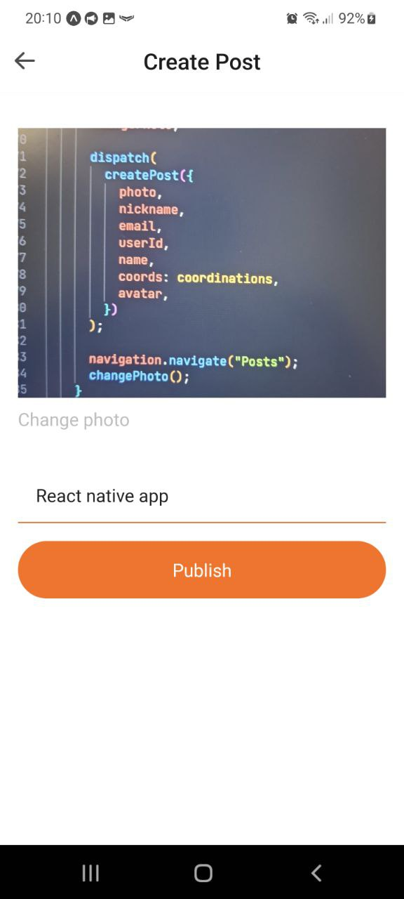

# React Native Social App for Android

## Technologies used:

- JavaScript
- React Navite Expo
- React Navigation
- Redux Toolkit (createAsyncThunk, CreateSlice, React Redux)
- Firebase Web version 9 (Authentication, Storage, Cloud Firestore )

### Default screen Sign in

- Hover over the selected input.
- Data validation. The email and password fields are required, if any of the fields are not filled in, an alert pops up with information.
- There is a link to go to the registration page.
- Button to show or hide the password.

  
  

### Sign up Screen

- Hover over the selected input.
- Data validation. The fields email, login, and password are required, if any of the fields are not filled, an alert pops up with information.
- There is a link to go to the login page.
- Button to show or hide the password.
- Add avatar camera window, an optional field by default the user will get an avatar.
- When you click on the plus, the camera will open. A button to take a picture and a flip camera button are available. Once the picture is taken, a cross icon is available that will reset the avatar box to its original state.
- After confirming the registration, the user goes to the Home component, where Tab Navigation is available (Posts by default, Create Posts Screen, Profile Screen)

  
  
  

### Posts Screen

- Posts of all users are displayed on the Posts Screen.
- When clicking on the comments button, the user is taken to the nested screen of the Comments Screen.
- Here is a photo of the post, as well as comments from all users.
- And input for sending a comment.
- Pressing the location button takes the user to a sub-screen of the Map Screen showing the location of the photo.
- There is a user logout button

  
  
  

### Create Posts Screen

- When first entering the screen, the user will be asked for permission to access the camera and geolocation.
- The screen displays a camera with the ability to flip the camera, and field name.
- There is data validation required data is a photo and name.
- After the picture is taken, the inscription to change the photo appears.
- After clicking on the publish button, the user is transferred to the Posts Screen

  
  

### Profile Screen

- Here is the user exit button, avatar (with the ability to change the avatar, as well as the ability to set the default avatar)
  and user posts.

  
